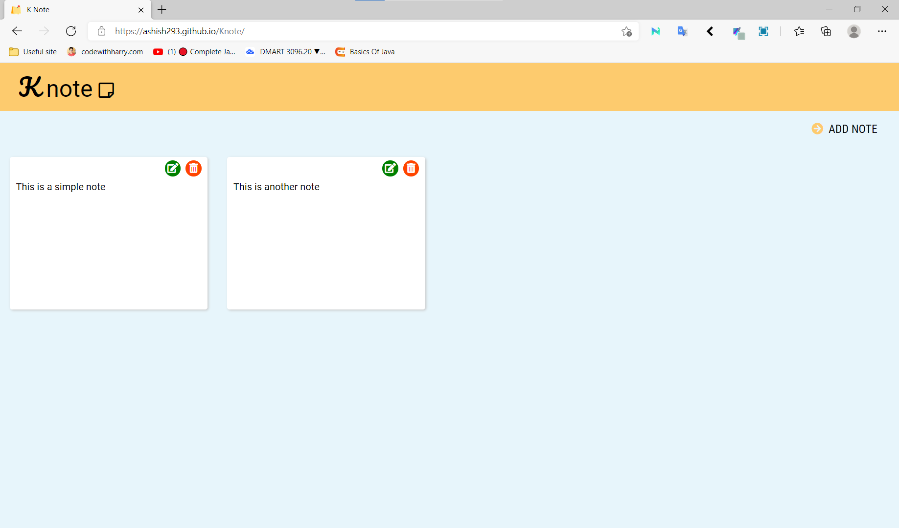
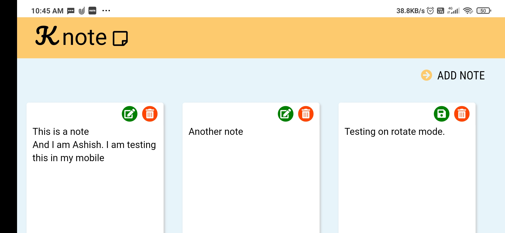
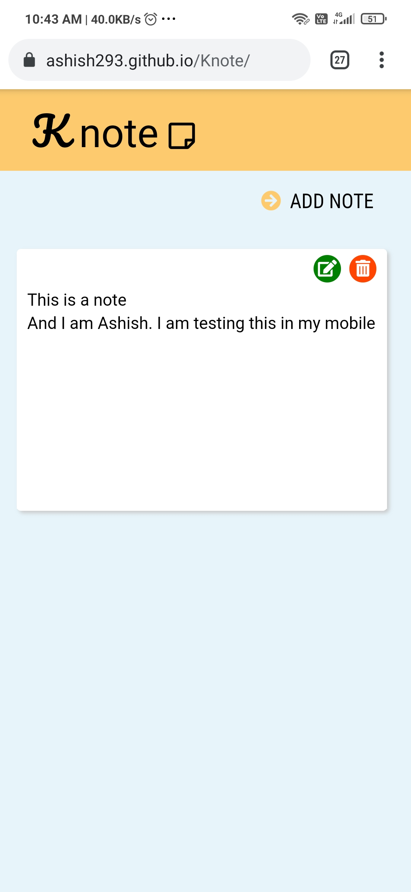

# Knote

	This is <strong>note app</strong> to save some text or notes. It use your
	<strong>local storage</strong> to store your data.

<h2>Link- <a href="https://ashish293.github.io/Knote/"> click here</a></h2>   

	 
	<strong>Knote desktop</strong>

 

	 
	<strong>Knote Tablet</strong>

 

	 
	<strong>Knote Mobile</strong>

